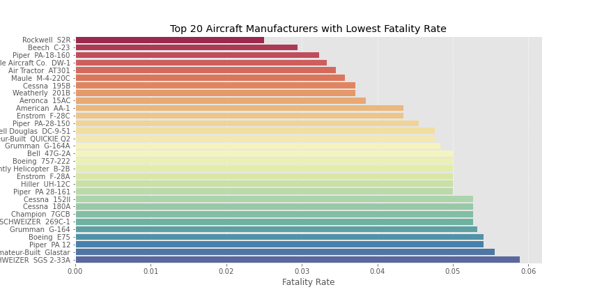
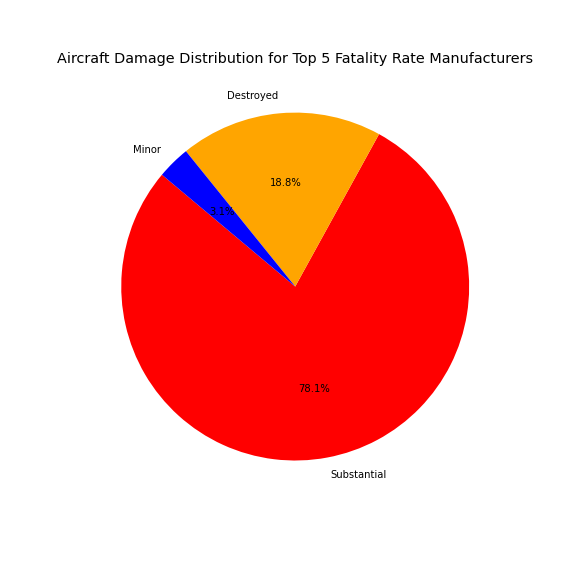
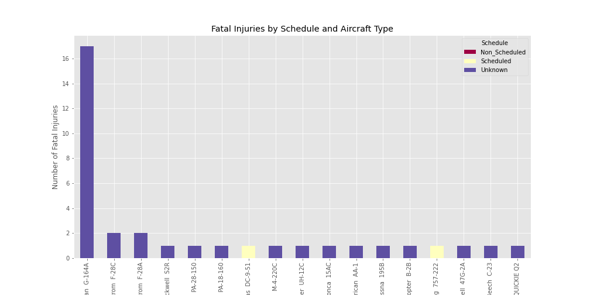
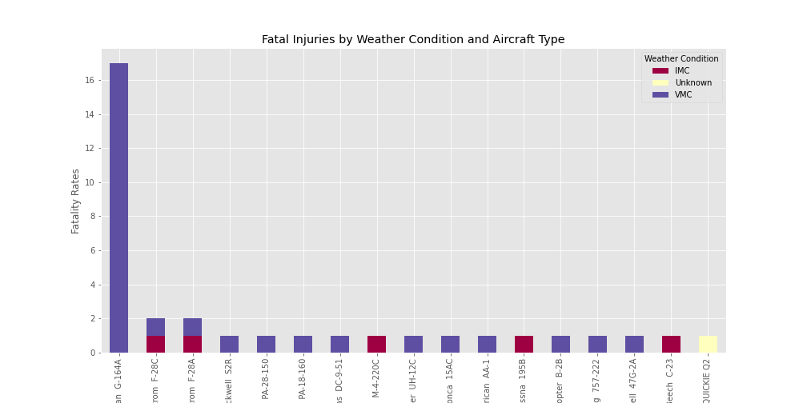
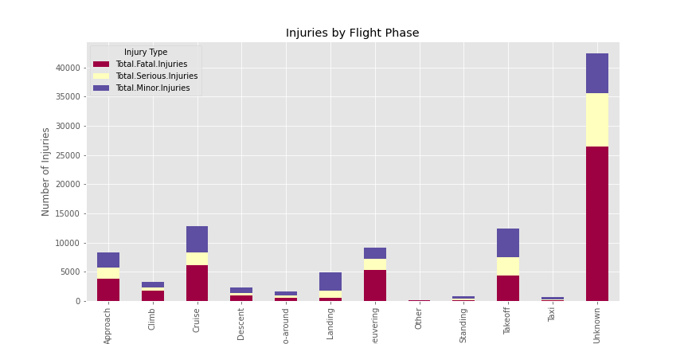
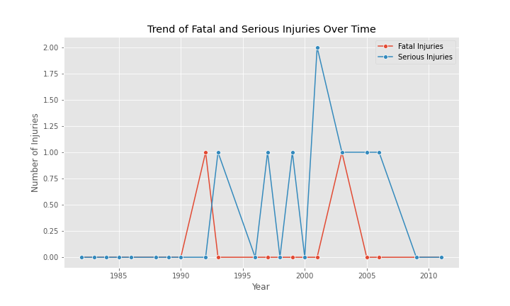

# OVERVIEW
## Purpose
This analysis aims to evaluate the safety records of various aircraft models, focusing on identifying those with the lowest risk for both commercial and private operations. The findings will assist the company in making informed purchasing decisions for its aviation division by minimizing risk exposure
## Scope
I will analyze civil aviation accident data, focusing on incidents involving commercial and private aircraft models. The analysis will highlight aircraft models with high reliability and safety and provide insights into the factors that contribute to low-risk profiles
#  Business Understanding
## Stakeholders:
Aviation Division Leadership: Responsible for making purchasing decisions for aircraft models.

Risk Management Team: Interested in minimizing risk exposure and ensuring the safety of operations.

Purchasing Department: Involved in sourcing aircraft that align with the company’s strategic goals of diversifying the portfolio
## Key Business Questions
Which aircraft models have the lowest safety-related incidents over time?

Are there any significant patterns in safety data related to aircraft model types or manufacturers?

What factors contribute to the likelihood of aircraft accidents and fatalities?

Which aircraft should the company consider purchasing to minimize exposure to aviation risks?
# Data Understanding and Analysis
## Source of Data:
The data is sourced from the National Transportation Safety Board (NTSB) aviation accident database, which contains records of civil aviation accidents and incidents from 1962 to the present day. The dataset is available on Kaggle and provides valuable information about accidents, aircraft types, weather conditions, and other variables.

## Description of Data:
The dataset includes the following columns:

Event.Date: Date of the accident/incident.

Location: Geographical location of the accident.

Aircraft Make: The manufacturer of the aircraft (e.g., Boeing, Cessna).

Model: The specific model of the aircraft involved in the incident.

Injury Severity: Total fatalities, serious injuries, minor injuries, and uninjured passengers.

Engine Type: Type of engine (e.g., piston, jet).

Weather Conditions: The weather during the time of the incident.

Phase of Flight: Whether the incident occurred during takeoff, cruising, or landing.

Accident Severity: A classification of the severity of the accident (fatal, serious, minor).

## Data Cleaning
Handling Missing Data: We will handle any missing data by either imputing values or excluding rows where necessary.

Data Consistency: Ensure the consistency of model names, injury severity, and date formats.

Duplicates: Remove duplicate entries if any exist.

## Exploratory Data Analysis
We will explore various aspects of the data, including:

Summary statistics on accident severity and injury types.

Trends over time in the number of accidents and injuries for different aircraft models.

Correlations between aircraft make/model, accident severity, and other factors like weather and flight phase.
# Visualizations
## Model vs Fatal Injuries
The bar plot shows the Fatality rate for each aircraft model. It provides a clear comparison of how different models contribute to fatal accidents, helping to identify which aircraft models are associated with higher fatality rates.

# Aircraft Damage Distribution for Top 5 Models
This pie chart visualizes the distribution of damage severity (e.g., "Destroyed", "Substantial", "Minor") for the top 5 aircraft models with the highest number of incidents in the dataset. It provides insight into how damage is distributed across these models, helping to identify patterns in the severity of accidents for different aircraft types.

# Fatality Injuries by Schedule and Aircraft Type
This visualization shows the distribution of fatal injuries based on the schedule (e.g., scheduled, non-scheduled) and aircraft make and model. It helps identify patterns in fatal injuries across different aircraft models and flight schedules, offering insight into whether certain models are more prone to fatal accidents.

# Fatal Injuries by Weather Conditions and Aircraft Models
This visualization displays the distribution of fatal injuries across different weather conditions (Good or Bad) and aircraft models. It provides insights into how weather conditions may influence the severity of accidents for various aircraft models, helping to identify potential risks associated with specific environmental factors and aircraft types.

# Injuries by Flight Phase
This visualization shows the distribution of injuries (e.g., fatal, serious, minor) during different phases of flight (e.g., takeoff, cruising, landing). It provides insights into the correlation between the phase of flight and the severity of injuries, helping to identify which stages of flight are most prone to accidents and injuries.

# Trends of Fatal and Serious Injuries Over Time for Boeing 757-222 and Mcdonnell Douglas DC-9-51 Models
This visualization illustrates the trends of fatal and serious injuries over time for two selected aircraft models. It highlights how the severity of injuries has changed throughout the years for these models, providing insights into whether safety improvements or other factors have impacted injury trends for these specific aircraft.

